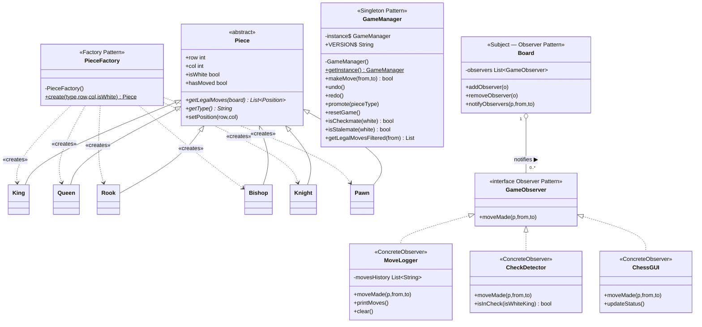
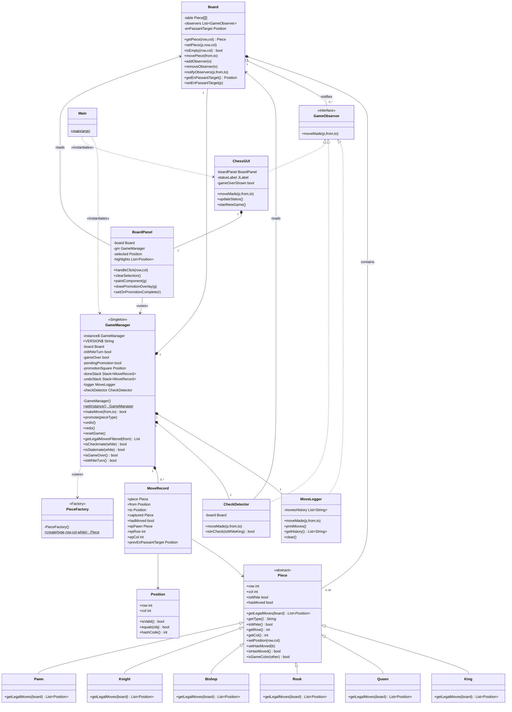

# Chess — Java Swing Implementation

A fully-featured two-player chess game built in Java with a Swing GUI.
Current version: **1.2.2**

---

## Features

- Full chess rules: legal move filtering, check, checkmate, stalemate
- En passant
- Pawn promotion with chess.com-style overlay picker
- Undo / Redo
- New Game button on game over
- Console move log with check / checkmate / stalemate messages

---

## Project Structure

```
src/
├── board/
│   ├── Board.java          # 8×8 grid + Observer subject
│   └── Position.java       # Immutable (row, col) value object
├── factory/
│   └── PieceFactory.java   # Factory Pattern — creates any piece by name
├── observer/
│   ├── GameObserver.java   # Observer interface
│   ├── MoveLogger.java     # Logs moves to console/history
│   └── CheckDetector.java  # Detects check after every move
├── pieces/
│   ├── Piece.java          # Abstract base class
│   ├── King.java
│   ├── Queen.java
│   ├── Rook.java
│   ├── Bishop.java
│   ├── Knight.java
│   └── Pawn.java
├── manager/
│   ├── GameManager.java    # Singleton Pattern — central game controller
│   └── MoveRecord.java     # Snapshot used by undo/redo stack
└── gui/
    ├── Main.java           # Entry point
    ├── ChessGUI.java       # JFrame + Observer — status bar, game-over popup
    └── BoardPanel.java     # JPanel — renders board, handles clicks
```

---

## Design Patterns

### 1. Factory Pattern — `PieceFactory`

`PieceFactory.create(type, row, col, isWhite)` is the single place where piece objects are constructed. Callers only need to pass a string name (`"Queen"`, `"Knight"`, etc.) and never depend on concrete subclasses directly.

**Why:** Adding a new piece type only requires creating the class and adding one `case` in the factory — no other code changes.

```
PieceFactory.create("Queen", 7, 3, true)
    → new Queen(7, 3, true)
```

---

### 2. Singleton Pattern — `GameManager`

`GameManager` holds the entire game state (board, turn, stacks, promotion state). It is constructed once and shared via `GameManager.getInstance()`. The constructor is private to prevent duplicate instances.

**Why:** Both `ChessGUI` and `BoardPanel` need the same game state. A singleton ensures they always read/write the same object without passing it around manually.

```java
// Access from anywhere in the app:
GameManager gm = GameManager.getInstance();
```

---

### 3. Observer Pattern — `Board` + `GameObserver`

`Board` is the **Subject**. After every move it calls `notifyObservers()`, which triggers all registered `GameObserver` implementations.

| Observer | What it does |
|---|---|
| `MoveLogger` | Records and prints the move to console |
| `CheckDetector` | Checks if the opponent's king is now in check |
| `ChessGUI` | Updates the status label ("White's turn", "Check!", etc.) |

**Why:** Each listener is completely independent. Adding a new feature (e.g. a sound player) only means implementing `GameObserver` and calling `board.addObserver(new SoundPlayer())` — zero changes to existing code.

---

## Diagram 1 — Design Patterns Focus



---

## Diagram 2 — Full UML Class Diagram



---

## How to Run

1. Clone the repo
2. Open in Eclipse (or any Java IDE)
3. Run `src/gui/Main.java`

**Requirements:** Java 17+, no external dependencies

---

## Console Output Reference

| Event | Console |
|---|---|
| Launch | `VERSION: 1.2.2` |
| New game | `VERSION: 1.2.2 — New game started` |
| Each move | `White Pawn moved from (1,4) to (3,4)` |
| Check | `Black King is in CHECK!` |
| Promotion | `Pawn promoted to Queen (7,3)` |
| Checkmate | `CHECKMATE! White wins!` |
| Stalemate | `STALEMATE! It's a draw.` |
