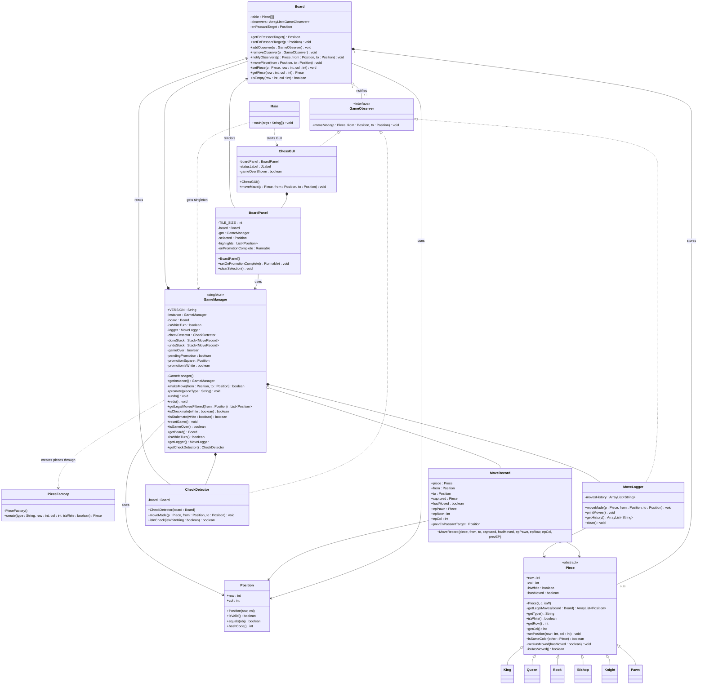
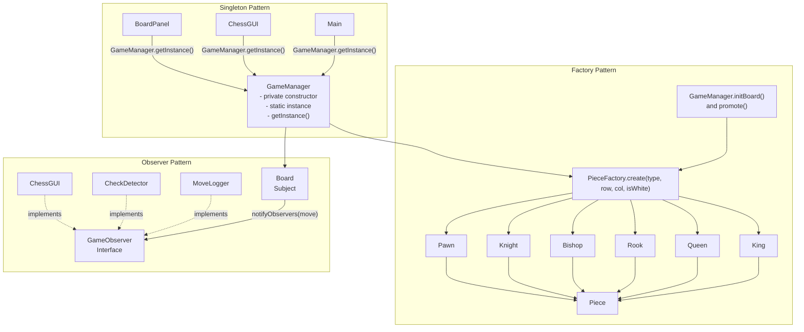

# Chess Project UML and Design Patterns

This document contains:

- A full UML-style class diagram for the chess project
- A focused diagram showing how the project implements the Observer, Factory, and Singleton patterns

## Full UML Class Diagram

## Design Patterns Diagram

## How Each Pattern Is Implemented

### 1. Observer Pattern

- `Board` is the subject because it stores a list of `GameObserver` objects.
- `Board.addObserver()` and `Board.removeObserver()` manage subscribers.
- `Board.notifyObservers()` sends move updates after a move is completed.
- `MoveLogger`, `CheckDetector`, and `ChessGUI` implement `GameObserver`.
- This keeps logging, check detection, and GUI updates separate from the core board storage logic.

### 2. Factory Pattern

- `PieceFactory.create(...)` is the single construction point for chess pieces.
- `GameManager.initBoard()` uses the factory to create all starting pieces.
- `GameManager.promote(...)` also uses the factory to create the promoted piece.
- The rest of the program can ask for a `"Queen"` or `"Knight"` without directly calling constructors everywhere.

### 3. Singleton Pattern

- `GameManager` has a private constructor and a private static `instance`.
- `GameManager.getInstance()` returns the same object throughout the app.
- `Main`, `ChessGUI`, and `BoardPanel` all rely on that shared game state.
- This ensures the GUI, board interactions, turn state, and undo/redo history all stay synchronized through one central controller.

## Suggested Use

- Use the full UML diagram for class-relationship documentation or assignment submission.
- Use the design patterns diagram when you want to explain architecture at a higher level.
- If you want, these Mermaid diagrams can also be converted into HTML or image exports later.
